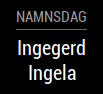

# MMM-Namnsdag
Magic Mirror module that displays Swedish names of the day. Relys on [Svenska Dagar Api](https://api.dryg.net/).


## Screenshot


## Install
This module uses [Yarn](https://yarnpkg.com/lang/en/).
```sh
  cd ~/MagicMirror/modules
  git clone https://github.com/Menturan/MMM-Namnsdag.git
  cd MMM-Namnsdag
  yarn install
```

## Configuration

| Key | Value | Required | Default | Description | 
|-----|-------|---------|---------|---------|
|debug|_boolean_| N| false| Debug output. |

## Example config

``` json
{
    module: "MMM-Namnsdag",
    position: "bottom_right",
    header: "Namnsdag"
}
```
## Development
This module isn't perfect. If you find a bug or has a feature request don't hesitate to create an issue OR even better, create a pull request! :D

